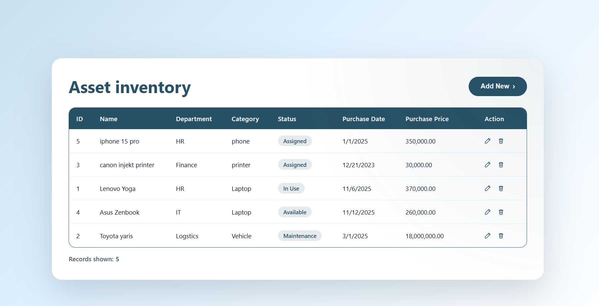

# Asset Management Platform

A full-stack application for tracking company assets. The project bundles an Express + Drizzle ORM backend with a React (Vite) frontend so you can capture, audit, and maintain inventory data from a single UI.

## Features

- **Asset inventory table** with sorting-friendly layout and in-row actions for Editing or Deleting.
- **Create / Update forms** with validation, confirmation prompts, and live field formatting.
- **REST API** (`/api/assets`) backed by PostgreSQL via Drizzle ORM.
- **Real-time UI feedback** (loading, error, and success states) with a cohesive theme.
- **TypeScript everywhere**—shared conventions across the server and client.

## Tech Stack

| Layer     | Technology |
|-----------|------------|
| Frontend  | React 19, Vite, React Router |
| Backend   | Node.js, Express 5, Drizzle ORM |
| Database  | PostgreSQL |
| Tooling   | TypeScript, ESLint, Prettier |

## Repository Layout

```
Asset-Management/
├── Backend/            # Express API + Drizzle schema
│   ├── src/
│   │   ├── controllers/
│   │   ├── db/
│   │   └── server.ts
│   ├── drizzle.config.ts
│   └── package.json
├── Frontend/           # React/Vite single-page application
│   ├── src/
│   │   ├── pages/
│   │   └── main.tsx
│   ├── vite.config.ts
│   └── package.json
└── README.md
```

## Prerequisites

- [Node.js 20+](https://nodejs.org/)
- [PostgreSQL 14+](https://www.postgresql.org/)
- npm (ships with Node)


## API Overview

| Method | Endpoint         | Description                     |
|--------|------------------|---------------------------------|
| GET    | `/api/assets`    | List all assets                 |
| GET    | `/api/assets/:id`| Retrieve a single asset         |
| POST   | `/api/assets`    | Create a new asset              |
| PUT    | `/api/assets/:id`| Update an existing asset        |
| DELETE | `/api/assets/:id`| Remove an asset permanently     |

Payload fields align with the form inputs (name, department, category, status, purchaseDate, purchasePrice).

## Screenshot

-

